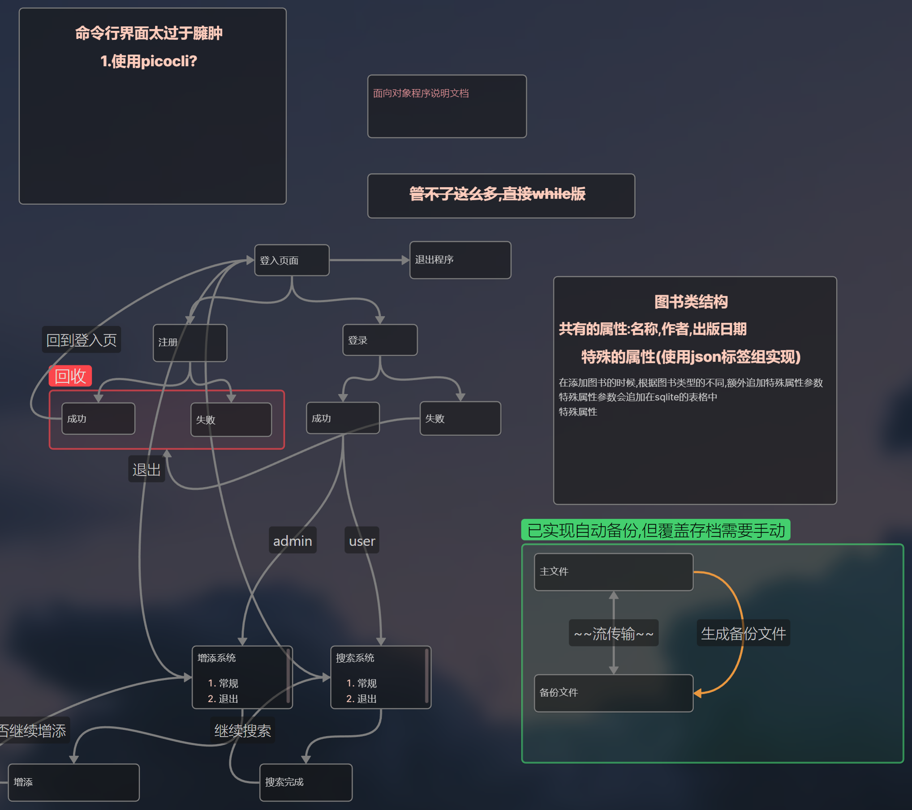

!我没写ISBN的参数因为项目写的差不多了才发现漏了参数,懒得加了

# 运行方式
>欢迎使用图书管理系统
>1. 注册
>2. 登录
>3. 退出

可以自行选择注册的用户类型,有user和admin
admin可以实现常规类型的增删,但是不能支持修改(可以删了之后重新录入)
user可以搜索书本内容,可以根据字段匹配从key:名称,作者,分类里进行查找

以上用户类型注册账号会填入library.db文件中的users表格里以--username--password--role键存储

主程序中有一个一小时为单位的线程会把db文件复制到backup文件夹内

在admin状态下
>1. 添加图书
>2. 删除图书
>3. 退出

添加图书的时候
常规参数包含:书名,作者,出版日期,类别
根据不同种类的书,系统会要求用户追加填写额外的参数
以上所有类别的书本以--title--author--publication_date--special_parameter
其中,special_parameter(额外参数)使用json格式存储

额外的参数暂时不支持在搜索里搜索

# 关于这个系统的扩展方式
如果需要新增图书种类:

需要在BookFactory中新增case
需要在main.java.com.aenustar.booktype文件夹下创建图书类

# 设计思路
设计了一个book的抽象类,各种类别的图书通过继承book类,实现book类的各种方法
我们将子类重写seSpecialParameter方法,在main中添加不同种类书籍的时候new不同类型的对象
让这些对象用重写过后方法向用户索取特殊参数

其他的功能都不是很复杂,用方法实现对功能就行.
